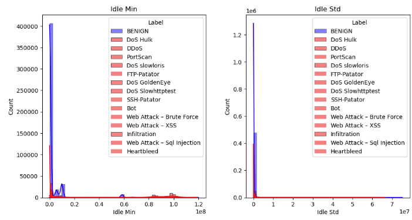
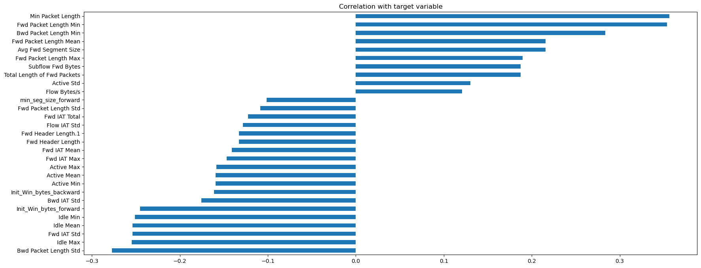
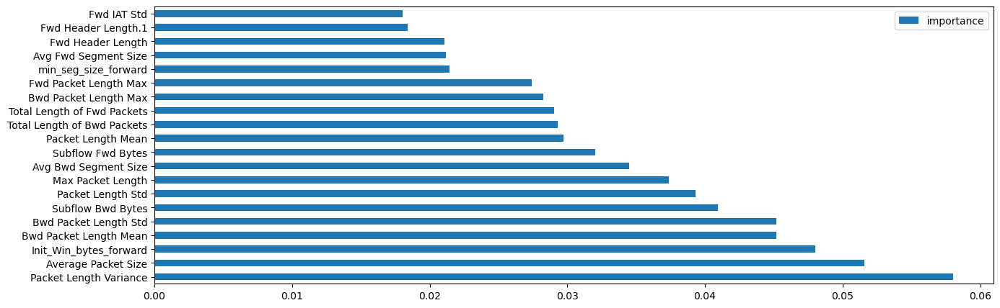
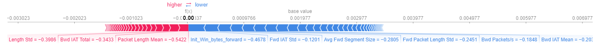

# Assignment Report Document:

This document outlines the submitted repository and specifies which files implement each part of the project.

## Importing and Familiarization with the Dataset

Implemented in the document `Loading_data.ipynb`.

## Dataset and Features Explanation:
The CICIDS2017 dataset is a comprehensive dataset used for research in the field of network intrusion detection and cybersecurity. Developed by the Canadian Institute for Cybersecurity (CIC) at the University of New Brunswick, it provides a realistic and diverse set of network traffic data that includes both benign and malicious activities. The data was collected over five days, from July 3 to July 7, 2017, and includes a mix of normal traffic and various attack types such as Distributed Denial of Service (DDoS), Web Attacks (SQL injection, XSS, Brute Force), and more. The features include identifiers like IP addresses, ports, and protocols, as well as transaction-specific features such as Flow Duration, Number of Packets, Length of Packets, Flow Bytes/s, and more. There are features for both forward and backward transactions.

## EDA & Preprocessing

Implemented in the document `CICIDS2017.ipynb`. This section includes an in-depth exploration of the data (missing values, distribution of features and targets, etc.) and prepares the data for machine learning models. This preprocessing involves handling problematic or missing values, processing categorical features, scaling, splitting the data into training and testing sets, and more. A significant challenge in this section was the frequent crashing of the kernel due to insufficient computational power. Attempts were made to switch to a different library (Dask) and to reduce computations by working in chunks, but these were unsuccessful. Ultimately, a sample of 600K rows was taken for analysis, leading to meaningful insights.

## Data Insights:

**Correlations and Data Distribution:**

It was observed that certain features with long, separated tails represent specific types of attacks. For example, features related to Idle (length of idle time) indicate that very high values almost always signify an attack. High idle times correlate with low target values (indicating an attack). It appears that when there are long idle times on the same flow, the attack has already achieved part of its goal. Therefore, to minimize damage, it might be beneficial to stop the communication when Idle features exceed a certain threshold.

**Feature Importance in Training a Random Forest:**

The image shows the top 20 most contributing features to the model. It is evident that packet length and size can indicate an attack. Therefore, monitoring the length and size of packets (both sending and receiving) can aid in detecting attacks.

**Feature Contribution to Single Case Detection using SHAP:**

For instance, the feature `Packets Length mean` suggests to the model that this is not a DDoS attack, as this value (after scaling) is relatively low compared to other samples. A low average packet length usually does not indicate an attack. Conversely, the feature `Init Win bytes forward` in this case contributes to the model's understanding that this is a DDoS attack because it is relatively low compared to the rest of the data, suggesting that the server is less capable of allocating initial sending space due to the numerous requests typical of a DDoS attack. Thus, identifying a continuous decrease in this feature can help in detecting an attack.

## Conclusion:
Machine learning and deep learning, combined with evaluation and the use of mathematics, can provide insights into data that might otherwise go unnoticed. Correctly using models to identify patterns in data, knowing which features require computational investment, and recognizing which features are less helpful in accurate detection can significantly aid in identifying and stopping attacks in time, thus maintaining network security.

## References:
1. CICIDS2017 Dataset: https://www.unb.ca/cic/datasets/ids-2017.html